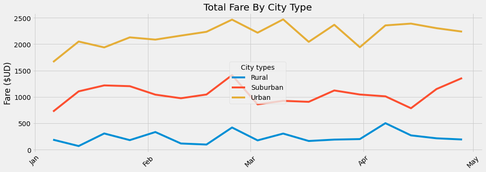

# Pyber Analysis 4th Challenge

## Overview of the analysis

In this analysis is shown in one graphic how the Total Fare by City type changed by in a period of time given, we saw tha in four months the fare didn't have a big change, only it had moments when the fare increased and then decreased.

## Results

As we can see in the graph named "Total Fare by City Type" the fare increased in the month of march and decreased a llitle from March to April but then we saw how the fares increased from april to may in each city type. 

With this graph we can see that there fare in the cities with more population and with more economic development is higher than for example the Rural cities in which the fare is less than 500 houndred total, in every month, compared to the Urban cities in which the fare sum is more than 2,000 in the beggining of February and then we only see a decrease of the fare in by the ending of April.

## Summary 

First we can see that for the Urban cities the fare only increases in the following months and the only fare that has minimun changes is the Rural, so I think an approach is to try to stablish a fare that doesn't vary a lot for the cities which give more income. 

Second, it's important to focus the service on the Urban and Suburban cities. 

Third, there is only a little number of drivers in the rural cities, so it's important to give a little increase to the number of drivers, this way maybe the number of fare could increase because more people will want to use the service.